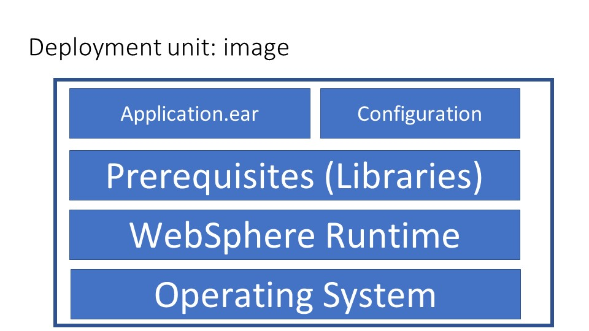
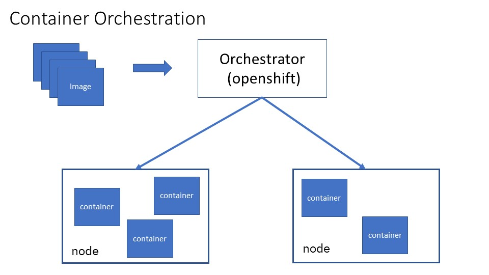
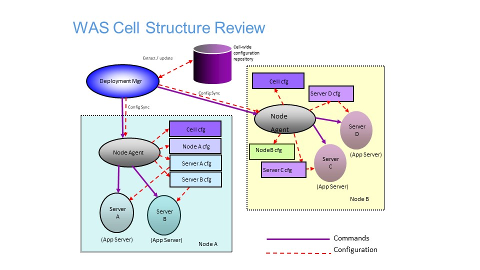

# Moving WebSphere Application Server to Cloud

## Table of Contents
* [Introduction](#Introduction)
* [Requirements Driving Changes](#Requirements)
* [Container Based Cloud](#Cloud)
* [Options to Move WebSphere Application Server to Cloud](#WAS_To_Cloud)

## Introduction

WebSphere Application Server is one of the most widely adopted application servers in the industry. 
Initially released in 1998, its current lineage may be traced back to V5.0, released in 2002.
V5.0 was a major re-write that enabled it to continue to innovate and remain relevant to its users.
Almost two decades later, as new requirements and new technologies emerged, WebSphere and its users must once make adjustments to adopt new technologies to meet emerging business requirements.

In this section we will:
- List requirements driving changes in IT infrastructure.
- Explain how those requirements are met with container based cloud infrastructure.
- Present options to adopt WebSphere in cloud
- Illustrate new Concepts, processes, and services to adopt in an Openshift based cloud.

## Requirements Driving Changes

The following requirements are the major driving factors for infrastructure innovation:
- Speed and agility of delivery
- Scale of Infrastructure
- Polyglot programming languages

With respect to speed and agility of delivery: the faster you deliver new features, and the faster you adjust to changing requirements, the better an edge you have over your competitors. 
Instead of a waterfall development process where applications are updated with frequency measured in months or even years, some organizations can now to deliver multiple times a day. 
To achieve such frequency, organizations are adopting:
- agile development process that reacts quickly to changing requirements, even on a daily basis.
- Cloud based IT infrastructure that uses automation to enables extremely fast turn-around when delivering new features.

With respect to scale of of infrastructure: it has grown enormously with increased usage via mobile applications, and increased number of users as rate of technology adoption increases. 
Some organizations are supporting hundreds of millions of users. 
Not only does the underlying infrastructure needs to support a large number of users, it must also support changing usage patterns. For example, paydays and holidays may place much higher demands on the infrastructure.
The switch from large monolithic applications to smaller microservices also places higher demand on infrastructure, as each service is independently developed and tested.

With respect to polyglot: ployglot means several languages. 
It is no longer the case that applications are developed using a single programming language. 
Application programmers now have multiple options, and increasingly they will choose the option that best fits their tasks. 
Examples of languages and runtimes include Java/Jakart EE, Spring, node, Ruby, Swift, and Python. 
An infrastructure capable of managing a polyglot environment provides more a consistent management experience, ease of use, and cost savings compared to having to maintain multiple environments.

## Container Based Cloud

This section provides a brief introduction to container based cloud, and how it meets the requirements from the previous section.
In a container based cloud, the unit of deployment is an image, not an application. For WebSphere Application Server, it looks like:

Instead of installing WebSphere Application server multiple times, once for each node, you start with an operating system image, and install WebSphere Application Server runtime to create a new image. 
This new image then serves as the basis from which to create additional images containing additional prerequisites, shared libraries, applications, and configurations.

To deploy the image, you will use a container orchestrator. The most popular container orchestrators are based on Kubernetes open source. We will use Openshift, which is based on Kuberentes but with additional security, user interface, and qualities of service value adds. Deployment through an container orchestrator looks looks like:

A container based cloud may be used to meet the requirements from the last section as follows:
- There are a variety of pre-existing tools, many opens source, that may be used to automate your processes.
- Using an "image" as the deployment unit allows you to run the same code, down to the operating system, across different environments, starting as early as the development environment. Catching defect early and consistency across environments shortens the debug and testing cycle.
- Each image may be tuned independently, according to the runtime used for that image.
- High availability and scalability is readily achieved because it is easy to kill a misbehaving container, or to start a new instance of the image.
- Kubernetes based orchestrators scale up to a very large environment, up to 150,000 pods.
- A container orchestrator is inherently polyglot, as the underlying image may use any product runtime. 
- Each image may run a different version of the underlying software, enabling difference pace of development for each application. 
- Consistent management interface across many software reduces the cost of administration.

## Options to Move WebSphere Application Server to Cloud

Let's start with a traditional WebSphere cell, which looks like:

A WebSphere cell is managed through a Deployment Manager, which is in control of one or more WebSphere nodes. The steps to install and deploy such an environment is as follows:
- Install and configure WebSphere Application server on all the nodes
- Create a WebSphere cluster
- Deploy the application to the cluster
- Synchronize the changes from the deployment manager to the nodes
- Start the application
First, let's refine the high level requirements in the last section into lower level requirements:

- Managing multiple programming languages and runtimes.
- fast installation/uninstallation.
- fast start time.
- small footprint.
- easy to scale up/down.
- easy to update.

Traditional WebSphere Application Server was designed for the time of monolithic application servers. 
It worked well when there are only a few large applications, and the project life cycle is not hours or days, but weeks or months. 
With the proliferation of micro services, and shortened project life cycle,  it lags behind in terms of:
- install time: about 20 minutes
- disk footprint: about 2 GB
- emory footprint: > 100 MBs 
- server start time: about 30 seconds
- migration to new version of WebSphere: weeks to months

WebSphere Liberty and Open Liberty were designed to address the above issues from the ground up:
- install time: seconds for unzip install 
- disk footprint: vraible based on features used, about 30 MB and up
- memory footprint: variable based features used, 30 MB and up
- server start time: 3-5 seconds
- migration to new version of WebSphere: seconds to days, depending on tests to be run

In terms of scale of infrastructure, traditional WebSphere had grown from supporting an environment of dozens of JVMs to an environment of 300-1000 JVMs. It is possible to support more by creating multiple WebSphere cells, but that makes the environment more difficult to manage. 